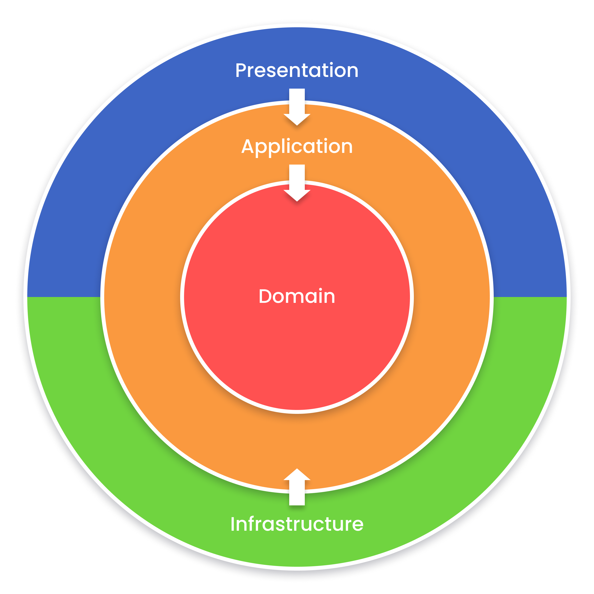

# Descripción inicial

El proyecto inicialmente está ejemplificado mediante la implementación de un CRUD (Crear, Leer, Actualizar, Eliminar) de un TODO. Esta funcionalidad sirve como base para demostrar la arquitectura y las prácticas de desarrollo utilizadas, facilitando la comprensión y la extensión del código para otros casos de uso y dominios.



## Arquitectura DDD & SOA

Este proyecto implementa una arquitectura en capas y basada en servicios, siguiendo principios de Diseño Dirigido por el Dominio (DDD) y Arquitectura Orientada a Servicios (SOA). La estructura del código facilita la escalabilidad, el mantenimiento y la reutilización, con una clara separación de las responsabilidades en capas de aplicación, dominio, infraestructura y presentación.Descripción concisa del proyecto.

## Estructura del Proyecto

El proyecto está organizado siguiendo una arquitectura modular y basada en servicios, que facilita la escalabilidad y mantenimiento del código. A continuación se detalla la estructura de archivos y carpetas:

### Archivos de Configuración

- `docker-compose.yml`: Configuración para Docker.
- `Dockerfile`: Archivo para construir la imagen Docker.
- `jest.config.js`: Configuración de Jest para pruebas.
- `nest-cli.json`: Configuración del CLI de NestJS.
- `package.json`, `pnpm-lock.yaml`: Gestión de dependencias.
- `tsconfig.json`, `tsconfig.build.json`: Configuración de TypeScript para desarrollo y producción.
- `README.md`: Documentación del proyecto.

### Estructura de Carpetas

- **`src/`**: Contiene el código fuente de la aplicación.
  - **`application/`**: Lógica de aplicación y casos de uso.
    - `application.module.ts`: Módulo principal de la capa de aplicación.
    - **`profiles/`**: Transformaciones y mapeos entre modelos.
    - **`useCases/`**: Implementaciones de casos de uso específicos (`todo`, etc.).
  - `app.module.ts`: Módulo raíz de la aplicación.
  - **`common/`**: Utilidades y clases compartidas.
    - **`classes/`**: Clases genéricas y abstractas.
    - **`constants/`**: Archivos de constantes.
    - **`decorators/`**: Decoradores personalizados.
    - **`filters/`**: Filtros para manejar excepciones HTTP.
    - **`guards/`**: Guardianes para manejos de las solicitudes con seguridad.
    - **`interceptors/`**: Interceptores para funciones comunes como transacciones.
    - **`types/`**: Definiciones de tipos y interfaces utilizadas en todo el proyecto.
  - **`domain/`**: Lógica del dominio.
    - `entities.ts`: Definición de entidades del dominio.
    - **`interfaces/`**: Interfaces para servicios y repositorios.
    - **`todo/`**: Lógica específica del dominio `todo`.
      - **`dto/`**: DTOs (Data Transfer Objects) relacionados con `todo`.
      - `todo.entity.ts`: Definición de la entidad `todo`.
  - **`infrastructure/`**: Detalles de implementación de infraestructura.
    - **`external/`**: Integraciones externas como adaptadores HTTP o servicios externos.
    - `infrastructure.module.ts`: Módulo principal de infraestructura.
    - **`persistence/`**: Capa de persistencia de datos.
      - **`context/`**: Contextos de base de datos u otros servicios.
      - **`database/`**: Configuración y conexiones a la base de datos.
      - **`repositories/`**: Implementaciones de los repositorios (`todo`, etc.).
  - `main.ts`: Punto de entrada principal de la aplicación.
  - **`presentation/`**: Capa de presentación.
    - **`controllers/`**: Controladores que manejan las solicitudes HTTP.
    - `presentation.module.ts`: Módulo principal de presentación.

### Pruebas

- **`__test__/`**: Contiene las pruebas unitarias y de integración.
  - **`application/`**, **`infrastructure/`**, **`presentation/`**: Pruebas organizadas por capas.
  - **`mocks/`**: Datos de prueba y mocks utilizados en las pruebas.

## Scripts

* **`build`**: `nest build`
  Compila el proyecto utilizando el compilador de NestJS.
* **`format`**: `prettier --write "src/**/*.ts" "__test__/**/*.ts"`
  Formatea el código fuente y los archivos de pruebas utilizando Prettier.
* **`start`**: `nest start`
  Inicia la aplicación en modo de producción.
* **`dev`**: `nest start --watch --preserveWatchOutput`
  Inicia la aplicación en modo de desarrollo, observando los cambios en los archivos para recargar automáticamente.
* **`start:debug`**: `nest start --debug --watch`
  Inicia la aplicación en modo de desarrollo con soporte para depuración y observando cambios.
* **`start:prod`**: `node dist/main`
  Inicia la aplicación desde el código compilado en modo de producción.
* **`lint`**: `eslint "{src,apps,libs,__test__}/**/*.ts" --fix`
  Ejecuta ESLint para verificar el código fuente y los archivos de prueba, aplicando correcciones automáticas donde sea posible.
* **`test`**: `jest`
  Ejecuta las pruebas unitarias y de integración utilizando Jest.
* **`test:watch`**: `jest --watch`
  Ejecuta las pruebas en modo observación, volviendo a ejecutarlas cuando se detectan cambios en los archivos.
* **`test:cov`**: `jest --coverage`
  Ejecuta las pruebas y genera un informe de cobertura de código.
* **`test:debug`**: `node --inspect-brk -r tsconfig-paths/register -r ts-node/register node_modules/.bin/jest --runInBand`
  Ejecuta las pruebas en modo de depuración.
* **`test:e2e`**: `jest --config ./test/jest-e2e.json`
  Ejecuta las pruebas end-to-end utilizando la configuración específica de Jest para pruebas E2E.
* **`lint-staged`**: `lint-staged`
  Ejecuta linting en los archivos staged utilizando lint-staged.
* **`prepare`**: `husky`
  Configura Husky para gestionar los hooks de Git.

## Environment

* DB_HOST
* DB_USERNAME
* DB_PASSWORD
* DB_DATABASE
* DB_PORT
* PORT

## Ejecución Local

### Requisitos

* Node.js
* PNPM (o NPM/Yarn, dependiendo de tu gestor de paquetes preferido)

### Pasos para la Ejecución Local

#### 1. Clonar el repositorio

```
git clone <NOMBRE_PROYECTO>
cd <NOMBRE_PROYECTO>
```

#### 2. Instalar dependencias

```
pnpm install
```

o si usas NPM:

```
npm install
```

o si usas Yarn:

```
yarn install
```

### Ejecución en Modo Desarrollo

Para ejecutar el proyecto en modo desarrollo, utiliza el siguiente comando:

```
pnpm dev
```

o si usas NPM:

```
npm run dev
```

o si usas Yarn:

```
yarn dev
```

Este comando iniciará la aplicación en modo de desarrollo con recarga automática cuando se detecten cambios en los archivos.

### Construcción y Ejecución en Modo Producción

1. **Construir el proyecto**:

   ```
   pnpm build
   ```

   o si usas NPM:

   ```
   npm run build
   ```

   o si usas Yarn:

   ```
   yarn build
   ```

   Este comando compilará el proyecto utilizando TypeScript.
2. **Ejecutar la aplicación**:

   ```
   pnpm start:prod
   ```

   o si usas NPM:

   ```
   npm run start:prod
   ```

   o si usas Yarn:

   ```
   yarn start:prod
   ```

   Este comando ejecutará la aplicación utilizando el código compilado en modo producción.

## Ejecución con Docker

### Requisitos

* Docker
* Docker Compose

### Pasos para Ejecutar con Docker

1. **Clonar el repositorio**:

   ```
   git clone <NOMBRE_PROYECTO>
   cd <NOMBRE_PROYECTO>
   ```
2. **Construir y levantar los contenedores**:

   ```
   docker compose up --build
   ```

   Este comando construirá las imágenes Docker y levantará los contenedores definidos en el archivo `docker-compose.yml`.
3. **Detener los contenedores**:

   ```
   docker compose down
   ```

   Este comando detendrá y eliminará los contenedores creados por Docker Compose.

### Archivos de Configuración

* **`docker-compose.yml`**: Contiene la configuración para los servicios Docker necesarios para ejecutar la aplicación.
* **`Dockerfile`**: Archivo utilizado para construir la imagen Docker de la aplicación.

### Variables de Entorno

Asegúrate de definir las variables de entorno necesarias en un archivo `.env` en la raíz del proyecto o directamente en el `docker-compose.yml` para configurar correctamente la aplicación.
